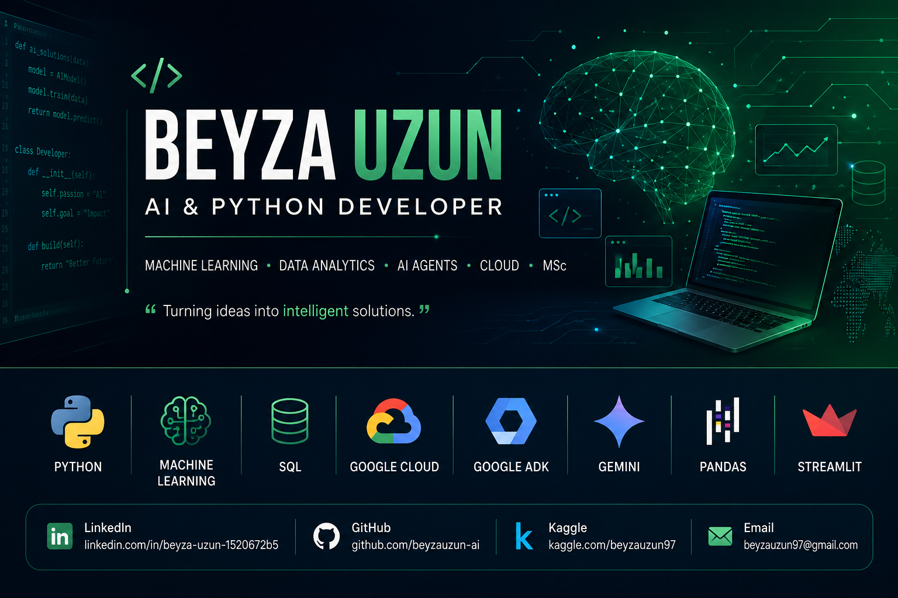

  

# Hi there, I'm Beyza Uzun 👋

### Junior Software Developer | Python Developer | AI & Machine Learning | MSc

## 👩‍💻 About Me

🎓 MSc in Chemistry Education

💻 Transitioned into Software Development

🤖 Passionate about Artificial Intelligence

🐍 Python Developer

☁️ Building AI applications using Google Cloud, Gemini API and ADK

📈 Interested in Machine Learning, RAG and Multi-Agent Systems

---

## 🚀 Tech Stack

- Python
- SQL (MySQL)
- JavaScript
- TypeScript
- HTML5 & CSS3
- Flask
- Streamlit
- Pandas
- NumPy
- Machine Learning
- Data Analysis
- Google ADK
- Gemini API
- Git & GitHub
- Docker
- Linux
- VS Code
- Power BI

---

## GitHub Stats

## Top Languages:

## Contribution Streak

---

## 🌟 Featured Projects

🤖 Multi-Agent AI Systems

📄 Gemini PDF Chatbot

🧠 Loan Risk Prediction

📊 Sales Data Assistant

🔍 Google Cloud RAG Agent

🧪 Customer Service AI Agent

---

## 📜 Certifications

- YÖK Data Analytics School
- IBM AI4Future
- IBM CyberStart 2.0
- Kaggle – Python
- Kaggle – SQL

---

## 🌱 Currently Learning

- 🤖 Multi-Agent AI Systems
- ☁️ Google Cloud (Vertex AI & Cloud Run)
- 🧠 Large Language Model (LLM) Applications
- 🔍 Retrieval-Augmented Generation (RAG)
- 🧩 Google ADK, MCP & A2A Protocols
- 📊 MLOps & AI Deployment Best Practices

---

## 📫 Connect with Me

- 💼 LinkedIn: https://linkedin.com/in/beyza-uzun-1520672b5
- 💻 GitHub: https://github.com/beyzauzun-ai
- 📊 Kaggle: https://kaggle.com/beyzauzun97
- 📧 Email: byzuzn09@gmail.com
---

⭐ Always learning, always building, always improving.
